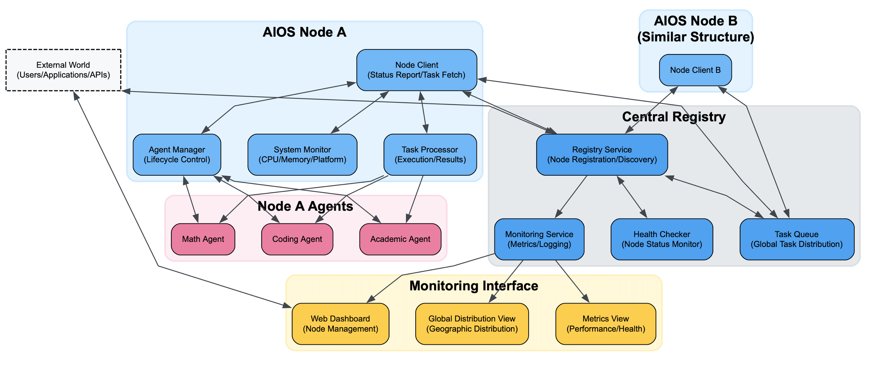

# Planet as a Brain: DAIOS – Towards Decentralized Agent Systems based on AIOS Server

<a href='https://docs.aios.foundation/'></a>
[](https://github.com/agiresearch/AIOS/blob/main/LICENSE)
<a href='https://discord.gg/B2HFxEgTJX'></a>

## 🌐 Introduction to AIOS Distributed Node Service

AIOS Registry Node is a key component of the [AIOS (AI Agent Operating System)](https://github.com/agiresearch/AIOS.Server) ecosystem, providing decentralized agent execution and node management capabilities. With the Registry Node service, you can:

- Contribute your computing resources as nodes to the AIOS network
- Deploy and execute AI agents in a distributed manner
- Join the global AIOS node network, participating in P2P agent discovery and execution
- Utilize DHT and Gossip protocols for efficient inter-node agent state synchronization

Registry Node service uses Distributed Hash Tables (DHT) and Gossip protocols to implement efficient, reliable agent discovery and state synchronization, ensuring nodes can work together in a distributed environment.

<p align="center">

</p>

## 📰 Version Notes

- **[2024-04-06]** 🔥 AIOS Registry Node distributed node service is now available!
- **[2024-04-05]** Added DHT and Gossip protocol support for decentralized agent discovery

## 📋 Installation

### Source Installation
1. **Clone Repository**
   ```bash
   git clone https://github.com/agiresearch/Cerebrum.git
   cd Cerebrum
   ```

2. **Create Virtual Environment**
   ```bash
   conda create -n cerebrum-env python=3.10
   conda activate cerebrum-env
   ```
   or
   ```bash
   python -m venv cerebrum-env
   source cerebrum-env/bin/activate  # Linux/MacOS
   ```

3. **Install Dependencies**
   ```bash
   pip install -e .
   ```

4. **Verify Installation**
   ```bash
   python -c "from cerebrum.registry_node import run_registry_node; print('Registry Node installed successfully')"
   ```

## ✈️ Quick Start: Running Registry Node

> ⚠️ **Important:** The Registry Node service requires the AIOS Kernel to be running first. The Registry Node connects to the Kernel to receive tasks and agent execution requests.

### Step 1: Start the AIOS Kernel

Before running a Registry Node, you need to start the AIOS Kernel:

1. Clone the AIOS Server repository:
   ```bash
   git clone https://github.com/agiresearch/AIOS.Server.git
   cd AIOS.Server
   ```

2. Follow the installation instructions in the [AIOS Server README](https://github.com/agiresearch/AIOS.Server)

3. Start the AIOS Kernel:

   The kernel should be running at `http://localhost:8000`

4. Configure API Keys:

Ensure you have configured the necessary API keys for the LLM models you want to use.


### Step 2: Start the Registry Node

Once the AIOS Kernel is running and your API keys are configured, you can start your Registry Node:

#### Command Line
Use the built-in command line tool to quickly start a node:

```bash
run-registry-node --registry_url https://app-test.aios.foundation --node_name my-node --agents example/demo_agent,example/academic_agent --default_llm gpt-4o-mini
```

Parameter description:
- `--registry_url`: Registry service address, recommended: https://app-test.aios.foundation
- `--node_name`: Node name (optional, default uses hostname)
- `--agents`: List of agents this node can run, comma-separated
- `--default_llm`: Default LLM model to use, such as gpt-4o-mini or gemini-1.5-flash
- `--report_interval`: Status reporting interval (seconds), default 30 seconds

#### Direct Script Execution
Alternatively, you can directly run the registry node example script:

```bash
python cerebrum/cerebrum/example/run_registry_node.py --registry_url https://app-test.aios.foundation --node_name my-node --agents example/demo_agent,example/academic_agent --default_llm gpt-4o-mini
```

#### Using Python Code

You can also start a Registry Node through Python code:

```python
from cerebrum.registry_node import RegistryNodeClient

# Create node client
client = RegistryNodeClient(
    registry_url="https://app-test.aios.foundation",
    node_name="my-awesome-node",
    report_interval=30,
    default_llm="gpt-4o-mini"
)

# Set available agents list
client.set_available_agents([
    "example/demo_agent",
    "example/academic_agent"
])

# Start node service
client.start()

try:
    # Keep program running
    import time
    while True:
        time.sleep(1)
except KeyboardInterrupt:
    # Graceful exit
    client.stop()
```

## 🔍 Distributed Node Architecture

AIOS's distributed node architecture consists of the following core components:

### 1. Node Infrastructure

- **BaseNodeClient**: Provides core node functionality, including status reporting and task management
- **SystemMonitor**: Monitors node system resource usage
- **TaskManager**: Manages agent execution tasks on the node
- **StatusReporter**: Regularly reports node status to the registry center

### 2. P2P Network Layer

#### DHT (Distributed Hash Table)
Used for efficient lookup and location of specific agents or resources:

```python
# DHT node lookup example
from cerebrum.p2p.dht.integrator import AgentDirectory

# Create agent directory service
directory = AgentDirectory(
    host="0.0.0.0",
    port=9000,
    bootstrap_nodes=[("seed.aios.foundation", 9000)]
)

# Start DHT service
await directory.start()

# Register agent
await directory.register_agent(
    agent_id="example/academic_agent",
    metadata={
        "capabilities": ["research", "summarize"],
        "description": "Academic research assistant"
    }
)

# Find agent
agent_info = await directory.find_agent("example/academic_agent")
```

#### Gossip Protocol
Used for efficient propagation of node state changes and agent availability information:

```python
# Gossip protocol example
from cerebrum.p2p.gossip.integrator import GossipIntegrator

# Create Gossip integrator
gossip = GossipIntegrator()

# Initialize Gossip service
await gossip.initialize()

# Register agent
gossip.register_agent(
    agent_id="example/academic_agent",
    capabilities=["research", "summarize"]
)

# Query agents with specific capabilities
research_agents = gossip.find_agents_by_capability("research")
```

## 🌍 View Your Node

After starting a Registry Node, your node will appear on the AIOS global node map. Visit [https://app-test.aios.foundation/nodes](https://app-test.aios.foundation/nodes) to view your node and its status.

You can also choose to use your node to run agents in the AIOS Agent Chat interface:

1. Visit [https://app-test.aios.foundation/chat](https://app-test.aios.foundation/chat)
2. Create a new conversation
3. Select "Custom Node" in settings
4. Choose your node from the node list
5. Start interacting with agents

## 🚀 Developing Custom Registry Node Features

If you want to extend Registry Node functionality, you can do so by inheriting the base class and adding custom logic:

```python
from cerebrum.registry_node.client import RegistryNodeClient

class MyCustomNodeClient(RegistryNodeClient):
    def __init__(self, registry_url, node_name=None, report_interval=30, default_llm="gpt-4o-mini"):
        super().__init__(registry_url, node_name, report_interval, default_llm)
        # Custom initialization
        
    def _registry_specific_setup(self):
        # Override specific settings
        print("Customized node setup")
        # Add custom functionality
```

## 📚 Supported LLM Cores

| Provider 🏢 | Model Name 🤖 | Open Source 🔓 | Model Identifier ⌨️ | Backend ⚙️ | Required API Key |
|:------------|:-------------|:---------------|:---------------|:---------------|:----------------|
| OpenAI | GPT-4o mini | ❌ | gpt-4o-mini |openai| OPENAI_API_KEY |
| Google | Gemini 1.5 Flash | ❌ | gemini-1.5-flash |google| GEMINI_API_KEY |

## 🚫 Troubleshooting

If you encounter node registration or operation issues, check:

1. Network connections and firewall settings
2. Correct API key configuration (for required LLM models)
3. Whether node resources (CPU, memory, disk space) are sufficient
4. Latest error logs
5. Ensure the AIOS Kernel is running and accessible

Common issues:
- **Node cannot register**: Check connection to registry_url and ensure AIOS Kernel is running
- **Agent execution fails**: Ensure LLM API keys are correctly configured
- **Status reporting error**: Might be a network connection issue or registry service temporarily unavailable

## 🤝 Community Support

Join our [Discord community](https://discord.gg/B2HFxEgTJX) for help, share your experiences, or discuss the future development of AIOS Registry Node!

## 📪 Contact

For issues related to Cerebrum and Registry Node development, we encourage submitting [issues](https://github.com/agiresearch/Cerebrum/issues), [pull requests](https://github.com/agiresearch/Cerebrum/pulls), or initiating discussions in the AIOS [Discord channel](https://discord.gg/B2HFxEgTJX). For other issues, please feel free to contact the AIOS Foundation ([contact@aios.foundation](mailto:contact@aios.foundation)).


